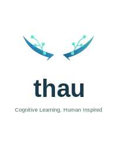

# THAU v3.1 - Unified AI Assistant Framework

<p align="center">
  
</p>

<p align="center">
  <strong>Cognitive Learning, Human Inspired</strong>
</p>

<p align="center">
  <em>Dedicated to Thomas and Aurora - watching you learn and grow inspired this project</em>
</p>

<p align="center">
  <a href="#models">Models</a> |
  <a href="#capabilities">Capabilities</a> |
  <a href="#installation">Installation</a> |
  <a href="#quick-start">Quick Start</a> |
  <a href="#developer-tools">Dev Tools</a> |
  <a href="#support">Support</a>
</p>

<p align="center">
  <a href="https://ollama.com/luepow/thau"></a>
  <a href="https://huggingface.co/luepow/thau-7b"></a>
  
  
  
</p>

---

## What's New in v3.1

- **THAU 7B**: New 7-billion parameter model based on Qwen2.5-7B-Instruct with LoRA fine-tuning
- **Enhanced Cognitive Reasoning**: Improved step-by-step problem solving
- **Multi-language Support**: Full Spanish and English capabilities
- **Unified Model**: All capabilities consolidated in a single `thau-1.1b` model
- **677 unique training examples** across 8 categories
- **Developer Orchestrator**: Multi-agent development environment
- **SVG/Asset Generation**: Create logos, icons, and visual elements
- **Accounting Support**: Double-entry bookkeeping and financial analysis

---

## Models

### Available Versions

| Model | Size | Base | Description | Command |
|-------|------|------|-------------|---------|
| **thau-7b** | 15 GB | Qwen2.5-7B | Advanced cognitive reasoning | `ollama run thau-7b` |
| **thau-1.1b** | 637 MB | TinyLlama | Unified lightweight model | `ollama run thau-1.1b` |
| thau:latest | 637 MB | TinyLlama | Alias for thau-1.1b | `ollama run thau` |
| thau:advanced | 2.2 GB | Qwen2.5-3B | Advanced reasoning + SVG | `ollama run thau:advanced` |
| thau:developer | 2.2 GB | Qwen2.5-3B | Code generation focus | `ollama run thau:developer` |
| thau:unified | 2.2 GB | Qwen2.5-3B | Combined specialized training | `ollama run thau:unified` |
| thau:reasoning | 2.2 GB | Qwen2.5-3B | Chain of thought specialist | `ollama run thau:reasoning` |
| thau:contable | 2.2 GB | Qwen2.5-3B | Accounting specialist | `ollama run thau:contable` |

### Recommended Models

```bash
# For best quality (requires 16GB+ RAM)
ollama run thau-7b

# For lightweight/fast inference
ollama run thau-1.1b

# Pull from Ollama Hub
ollama pull luepow/thau
```

### Model Comparison

| Feature | thau-7b | thau-1.1b | thau:advanced |
|---------|---------|-----------|---------------|
| Code Generation | ✅ | ✅ | ✅ |
| SVG/Assets | ✅ | ✅ | ✅ |
| Reasoning (CoT) | ✅✅ | ✅ | ✅ |
| Accounting | ✅ | ✅ | ❌ |
| Tool Calling | ✅ | ✅ | ✅ |
| Spanish/English | ✅ | ✅ | ✅ |
| Context Length | 4096 | 2048 | 4096 |
| RAM Required | 16GB+ | 4GB+ | 8GB+ |

---

## Capabilities

### Core AI Capabilities

| Capability | Status | Description |
|------------|--------|-------------|
| **MCP Integration** | ✅ Full | Model Context Protocol for tool invocation |
| **Code Agent** | ✅ Full | Autonomous agent for code generation/editing |
| **TTS (Text-to-Speech)** | ✅ Full | Offline voice synthesis (pyttsx3) |
| **STT (Speech-to-Text)** | ✅ Full | Whisper/Google Speech Recognition |
| **SVG Generation** | ✅ Full | Animated SVG assets and icons |
| **Chain of Thought** | ✅ Full | Step-by-step reasoning |
| **Tool Calling** | ✅ Full | JSON-based function invocation |
| **Proto-AGI** | ✅ Framework | ReAct + multi-agent orchestration |

### 1. Programming (1,328 examples)

Full-stack development support:

```
Languages: Python, JavaScript, TypeScript, Java, Rust, Go, SQL
Frameworks: React, Next.js, FastAPI, Flask, Spring Boot
Patterns: Clean Architecture, SOLID, Design Patterns
```

**Example:**
```
User: Create a FastAPI endpoint for user authentication

THAU: **api/auth.py**
```python
from fastapi import APIRouter, HTTPException, Depends
from pydantic import BaseModel
from datetime import datetime, timedelta
import jwt

router = APIRouter(prefix="/auth", tags=["authentication"])

class LoginRequest(BaseModel):
    email: str
    password: str

@router.post("/login")
async def login(request: LoginRequest):
    # Validate credentials
    user = await validate_user(request.email, request.password)
    if not user:
        raise HTTPException(401, "Invalid credentials")

    # Generate JWT token
    token = jwt.encode({
        "sub": user.id,
        "exp": datetime.utcnow() + timedelta(hours=24)
    }, SECRET_KEY)

    return {"access_token": token, "token_type": "bearer"}
```

### 2. SVG/Asset Generation (26 examples)

Create visual elements directly:

```
Logos, Icons, Animations, Charts, Diagrams
```

**Example:**
```
User: Create a loading spinner SVG

THAU: **spinner.svg**
```svg
<svg viewBox="0 0 50 50" width="50" height="50">
  <circle cx="25" cy="25" r="20" fill="none"
          stroke="#3498db" stroke-width="4"
          stroke-dasharray="80 40">
    <animateTransform attributeName="transform"
                      type="rotate" dur="1s"
                      from="0 25 25" to="360 25 25"
                      repeatCount="indefinite"/>
  </circle>
</svg>
```

### 3. Chain of Thought Reasoning (25 examples)

Step-by-step problem solving:

```
### Paso 1: Análisis del problema
[Breakdown of the problem]

### Paso 2: Identificar variables
[Key variables and constraints]

### Paso 3: Solución
[Step-by-step solution]

### Conclusión
[Final answer with explanation]
```

### 4. Accounting (488 examples)

Financial and accounting support:

```
- Double-entry bookkeeping
- Financial statements (Balance Sheet, Income Statement, Cash Flow)
- Journal entries
- Cost analysis
- Budget planning
```

**Example:**
```
User: Record a $5,000 equipment purchase paid in cash

THAU:
| Account | Debit | Credit |
|---------|-------|--------|
| Equipment | $5,000 | |
| Cash | | $5,000 |

Explanation: Equipment (asset) increases with debit, Cash (asset) decreases with credit.
```

### 5. DevOps & Agile (185 examples)

```
- CI/CD pipelines (GitHub Actions, GitLab CI)
- Docker, Kubernetes
- Git workflows
- Scrum, Kanban methodology
- Infrastructure as Code
```

### 6. Tool Calling

Native JSON-based tool invocation:

```json
<tool_call>{"name": "get_current_time", "arguments": {}}</tool_call>
<tool_call>{"name": "web_search", "arguments": {"query": "Python tutorials"}}</tool_call>
<tool_call>{"name": "execute_python", "arguments": {"code": "print(2+2)"}}</tool_call>
```

**Available Tools:**
- `get_current_time`: Get current date/time
- `web_search`: Search the internet
- `execute_python`: Run Python code
- `generate_image`: Generate image from prompt
- `read_file`: Read file contents
- `list_directory`: List directory contents
- `create_file`: Create new files
- `analyze_project`: Analyze project structure

### 7. MCP (Model Context Protocol) Integration

Full MCP server implementation for standardized tool communication:

```python
from capabilities.tools.mcp_integration import MCPServer

# Initialize MCP server
mcp = MCPServer()

# Register custom tools
mcp.registry.register_tool(
    name="my_tool",
    description="Custom tool description",
    parameters={"query": {"type": "string"}},
    handler=my_handler_function
)

# Export OpenAI/Claude compatible schema
schema = mcp.registry.export_schema(format="openai")
```

**Features:**
- Compatible with Claude, OpenAI, and custom LLM integrations
- Docker and stdio external server support
- Built-in tools: image generation, calendar, REST API calls
- Parameter validation and error handling

### 8. Voice Capabilities (TTS/STT)

**Text-to-Speech (TTS):**

```python
from capabilities.voice.tts_service import TTSService

tts = TTSService()
tts.speak("Hola, soy THAU")  # Immediate playback
audio = tts.synthesize_to_file("Texto a convertir", "output.wav")
```

- Offline synthesis with pyttsx3
- Multiple Spanish voices (Eddy, Rocko, Sandy, Paulina)
- Adjustable speed and volume
- Audio caching for performance

**Speech-to-Text (STT):**

```python
from capabilities.audio.speech_recognition import SpeechRecognizer

stt = SpeechRecognizer(backend="whisper")  # or "google", "vosk"
text = stt.listen_from_microphone()
text = stt.transcribe_file("audio.wav")
```

- Multiple backends: Whisper (local), Google (online), Vosk (lightweight)
- Microphone input with calibration
- Continuous listening mode with callbacks

### 9. Code Agent (Autonomous Development)

Autonomous agent capable of reading, writing, and editing code:

```python
from capabilities.agent.code_agent import CodeAgent

agent = CodeAgent(model="thau-7b")
result = agent.execute_task(
    "Create a FastAPI endpoint for user registration with email validation"
)
```

**Agent Capabilities:**
- File operations: read, write, edit, glob, grep
- Bash command execution
- Multi-step task completion
- Error recovery and iteration
- Context-aware code generation

### 10. Proto-AGI Framework

Experimental AGI capabilities with ReAct pattern:

```python
from capabilities.proto_agi.thau_agi_v2 import ThauAGIv2

agi = ThauAGIv2()
response = agi.think_and_act(
    "Research the best practices for Python async programming and create a summary"
)
```

**Components:**
- ReAct (Reason-Act-Observe) cycle
- Experiential learning and memory
- Multi-agent coordination
- Knowledge base with RAG
- Metacognition and self-reflection

---

## Installation

### Prerequisites

- Python 3.10+
- [Ollama](https://ollama.ai) (for running models locally)
- 4GB+ RAM (8GB recommended)

### Quick Setup

```bash
# Clone the repository
git clone https://github.com/luepow/thau.git
cd thau

# Create virtual environment
python -m venv venv
source venv/bin/activate  # Windows: venv\Scripts\activate

# Install dependencies
pip install -r requirements.txt

# Install THAU model
ollama pull luepow/thau
```

---

## Quick Start

### 1. Chat with THAU

```bash
# Interactive chat
ollama run thau-1.1b

# Single prompt
ollama run thau-1.1b "Explain Python decorators with examples"
```

### 2. Use the API

```bash
# Start the API server
python api/main.py

# Test endpoint
curl -X POST http://localhost:8000/chat/message \
  -H "Content-Type: application/json" \
  -d '{"message": "Hello, who are you?"}'
```

### 3. Developer Orchestrator

Multi-agent development environment with specialized agents:

```bash
# Start the orchestrator
python scripts/thau_dev_orchestrator.py

# Access at http://localhost:7868
```

**Features:**
- Code Agent: Write and refactor code
- Test Agent: Generate unit tests
- Review Agent: Code review and suggestions
- Doc Agent: Generate documentation
- Architect Agent: System design

---

## Developer Tools

### THAU Dev Orchestrator

Web-based IDE with multi-agent support:

```bash
python scripts/thau_dev_orchestrator.py
# Opens at http://localhost:7868
```

### Training Scripts

```bash
# Train THAU 7B (requires 64GB+ RAM or GPU with 24GB+ VRAM)
python scripts/train_thau_7b.py

# Merge LoRA adapters and export to Ollama
python scripts/merge_and_export_thau.py

# Train unified 1.1B model
python scripts/train_thau_unified.py

# Train specialized models
python scripts/train_reasoning.py
python scripts/train_contable.py

# Generate training data
python scripts/intensive_learning.py --questions 100

# Upload to HuggingFace
python scripts/upload_to_huggingface.py --model thau-7b --token YOUR_TOKEN
```

### THAU 7B Training Details

The 7B model was trained using:
- **Base Model**: Qwen/Qwen2.5-7B-Instruct
- **Method**: LoRA (Low-Rank Adaptation) with r=16, alpha=32
- **Hardware**: Apple M2 Max 96GB / NVIDIA GPU with 24GB+ VRAM
- **Training**: 400 steps, 2.5 epochs, batch size 2
- **Dataset**: Custom cognitive reasoning and programming examples
- **Format**: ChatML template with system prompt

### Gradio Interfaces

```bash
# AGI Interface
python scripts/gradio_thau_agi.py

# Simple Ollama Chat
python scripts/gradio_thau_ollama.py
```

---

## Training Data Summary

| Category | Examples | Description |
|----------|----------|-------------|
| Programming | 1,328 | Python, JS, Java, Rust, Go, SQL, Web |
| Accounting | 488 | Double-entry, financial statements |
| Development | 185 | Agile, DevOps, Git, CI/CD |
| UX/UI | 76 | Design, CSS frameworks |
| Algorithms | 40 | Data structures, complexity |
| SVG/Assets | 26 | Logos, icons, animations |
| Reasoning | 25 | Chain of thought, step-by-step |
| Other | 89 | Tool calling, agents |
| **Total** | **677** | Unique examples (after deduplication) |

---

## Architecture

```
thau/
├── api/                    # REST API (FastAPI)
│   ├── main.py
│   └── routes/
├── core/                   # Core ML components
│   ├── models/             # Neural network architectures
│   ├── training/           # Training infrastructure
│   └── inference/          # Text generation
├── memory/                 # Memory systems
│   ├── short_term.py       # Conversation context
│   ├── long_term.py        # Vector store (ChromaDB)
│   └── episodic.py         # Temporal experiences
├── reasoning/              # Reasoning capabilities
│   ├── chain_of_thought.py # CoT prompting
│   ├── planning.py         # Task decomposition
│   └── reflection.py       # Self-reflection
├── capabilities/           # Extended capabilities
│   ├── agent/              # Code Agent (autonomous)
│   ├── agents/             # Multi-agent system
│   ├── proto_agi/          # AGI framework (ReAct, learning)
│   ├── tools/              # MCP integration
│   ├── voice/              # TTS service
│   ├── audio/              # STT recognition
│   └── video/              # SVG animator
├── scripts/                # Training & utility scripts
│   ├── train_thau_7b.py
│   ├── merge_and_export_thau.py
│   ├── upload_to_huggingface.py
│   └── thau_dev_orchestrator.py
├── assets/                 # Static assets
│   └── thau_logo.svg
└── data/
    ├── datasets/           # Training datasets
    ├── checkpoints/        # LoRA checkpoints
    └── models/             # Merged models (HF & GGUF)
```

---

## API Reference

### Chat Endpoints

```bash
# Send message
POST /chat/message
{"message": "Hello", "context": []}

# Stream response
POST /chat/stream
{"message": "Explain recursion", "stream": true}
```

### Training Endpoints

```bash
# Add training interaction
POST /train/interaction
{"user_input": "What is X?", "assistant_response": "X is..."}

# Get training stats
GET /train/stats
```

### Memory Endpoints

```bash
# Store memory
POST /memory/store
{"content": "Important fact", "importance": 8}

# Recall memories
POST /memory/recall
{"query": "search term", "n_results": 5}
```

---

## Configuration

Key settings in `.env`:

```bash
# Model
MODEL_NAME=thau-1.1b
DEVICE=auto  # auto, cuda, mps, cpu

# Generation
TEMPERATURE=0.7
TOP_P=0.9
MAX_LENGTH=4096

# API
API_PORT=8000
```

---

## Support This Project

If you find THAU useful, consider supporting its development:

<p align="center">
  <a href="https://buymeacoffee.com/luepowg"></a>
  <a href="https://github.com/sponsors/luepow"></a>
  <a href="https://www.paypal.com/donate/?hosted_button_id=NDASZU5WWUUMJ"></a>
</p>

---

## Current Limitations

THAU is a work in progress. Current limitations include:

| Feature | Status | Notes |
|---------|--------|-------|
| Video Processing | Not implemented | Only SVG animations, no MP4/WebM |
| Image Generation | External only | Requires external API (DALL-E, etc.) |
| Vision/Multimodal | Not implemented | Cannot process images |
| Internal Thinking | Not implemented | No hidden reasoning tokens |
| Real-time Learning | Limited | LoRA fine-tuning required |

The quality of agent tasks and reasoning depends heavily on the base model (Qwen2.5-7B). For production use cases requiring consistent results, consider using larger models or fine-tuning on domain-specific data.

---

## License

Apache 2.0 License - see [LICENSE](LICENSE) for details.

---

## Acknowledgments

- **Thomas & Aurora** - My children, whose learning journey inspired this project
- **Claude (Anthropic)** - AI pair programming partner throughout development
- **TinyLlama Team** - For the excellent base model
- **Hugging Face** - For the transformers library
- **Ollama Team** - For making local LLM deployment accessible

---

## Contact

- **Author**: Luis Perez
- **Email**: luepow@hotmail.com
- **GitHub**: [@luepow](https://github.com/luepow)

---

<p align="center">
  <em>THAU - Built with curiosity, love, and collaboration with Claude</em>
</p>

<p align="center">
  
</p>
